# 2024-AI-Specialized-education

# 재난 트윗 분석 및 분류

## 📖 대회 소개
Natural Language Processing with Disaster Tweets은 트윗(Tweets)을 분석하여 해당 트윗이 실제 재난과 관련된 것인지 아닌지를 예측하는 머신러닝 모델을 구축하는 것이 목표입니다. 

이 프로젝트를 위해 다음과 같은 항목을 진행했습니다.
- 데이터 분석 및 시각화(EDA)
- 데이터 전처리
- 딥러닝 기반 분류 모델 생성 
- 모델 학습 및 평가 데이터셋에 대해 예측
---

## 📊 데이터 설명
훈련 및 테스트 데이터셋의 각 샘플은 다음과 같은 정보를 포함합니다:
- **tweet text**: 트윗 본문의 텍스트
- **keywords**: 트윗에서 추출된 특정 키워드 (비어 있을 수 있음)
- **location**: 트윗이 작성된 위치 정보 (비어 있을 수 있음)

---

## 📂 파일 구성
- **`train.csv`**: 훈련 데이터셋  
- **`test.csv`**: 테스트 데이터셋  
- **`sample_submission.csv`**: 제출 형식 예제를 포함한 파일  

---

## 📑 컬럼 설명
- **`id`**: 각 트윗의 고유 식별자
- **`text`**: 트윗 본문의 텍스트
- **`location`**: 트윗이 작성된 위치 (비어 있을 수 있음)
- **`keyword`**: 트윗에서 추출된 특정 키워드 (비어 있을 수 있음)
- **`target`**: **train.csv에만 포함**, 해당 트윗이 실제 재난과 관련된 것인지 여부를 나타냄  
  - `1`: 실제 재난과 관련 있음  
  - `0`: 실제 재난과 관련 없음

---

## 📂 프로젝트 구성
1. **데이터 분석 (EDA)**
   - 결측치 분석
   - target 열의 데이터 분석
   - 재난/비재난의 텍스트 길이 분석
   - 재난/비재난의 단어 빈도 분석
   - stopwords을 제거한 후 재난/비재난의 단어 빈도 분석
   - 해시태그/특수문자가 재난/비재난 트윗에 미치는 여부 분석
   - location 열 결측치와 고유값 분석 
   - 문장의 감정이 재난 트윗 분류에 영향을 미치는지 분석

2. **데이터 전처리**
   - 트윗 데이터의 특성을 반영하여 다음과 같은 전처리 단계를 설계:
     - **불필요한 텍스트 제거**: URL, HTML 태그, 특수문자 등 제거.
     - **정규화**: 모든 텍스트를 소문자로 변환.
     - **토큰화**: RoBERTa 전용 토크나이저를 사용하여 텍스트를 단어 단위로 분리.
     - **불용어 제거**: "the", "is" 등 의미 전달에 기여하지 않는 단어 제거.
    

3. **모델 설계**
   - **모델**: RoBERTa (`roberta-base`)를 기반으로 미세 조정(Fine-tuning) 수행.
   - **데이터 처리**: Hugging Face 토크나이저를 사용해 입력 데이터를 토큰화하고, 패딩과 트렁케이션을 적용.
   - **손실 함수**: Cross-Entropy Loss 사용.
   - **최적화 알고리즘**: Adam 옵티마이저.

4. **학습 설정**
   - **배치 크기**: 8  
   - **학습 횟수 (Epoch)**: 10  
   - **드롭아웃 비율**: 0.1  

5. **평가 지표** 
   - **Accuracy**: 전체 데이터 중 올바르게 분류된 데이터 비율.
   - **F1 Score**: Precision과 Recall 간의 조화를 나타내는 지표.
   - **Precision**: 모델이 재난 트윗으로 예측한 데이터 중 실제 재난 데이터의 비율.
   - **Recall**: 실제 재난 데이터 중에서 올바르게 예측된 데이터 비율.

6. **평가 수행**
   - 검증 데이터로 **F1 Score**와 **Accuracy**를 계산해 모델 성능을 평가.
   - 최종적으로 테스트 데이터에 대해 예측값 제출.

---

## 🛠 사용된 리소스
- **라이브러리**: `Numpy`, `Pandas`, `Matplotlib`, `Seaborn`, `Wordcloud`, `Scikit-Learn`, `TextBlob`, `Scipy`, `Transformers`, `Torch`, `Tqdm`, `Peft`
- **데이터셋**: [Disaster Tweets Dataset](https://www.kaggle.com/c/nlp-getting-started)

---

## 📊 데이터 탐색 (EDA)
### 1. 결측치 분석 시각화
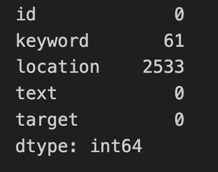
- 데이터셋 내 결측치 분포를 시각화하여 데이터 정리의 필요성을 확인합니다.

### 2. Target 열 데이터 분포 분석
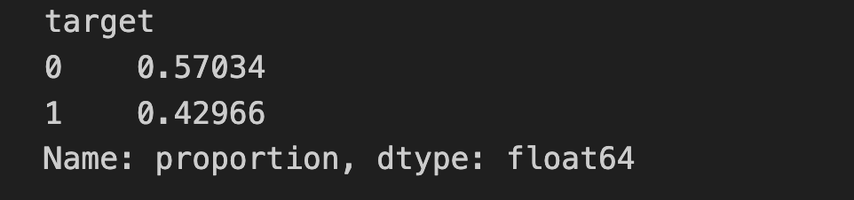
- Target 열(재난 여부)의 데이터 분포를 시각화하여 데이터의 불균형 여부를 분석합니다.

### 3. 재난/비재난 트윗의 텍스트 길이 분석
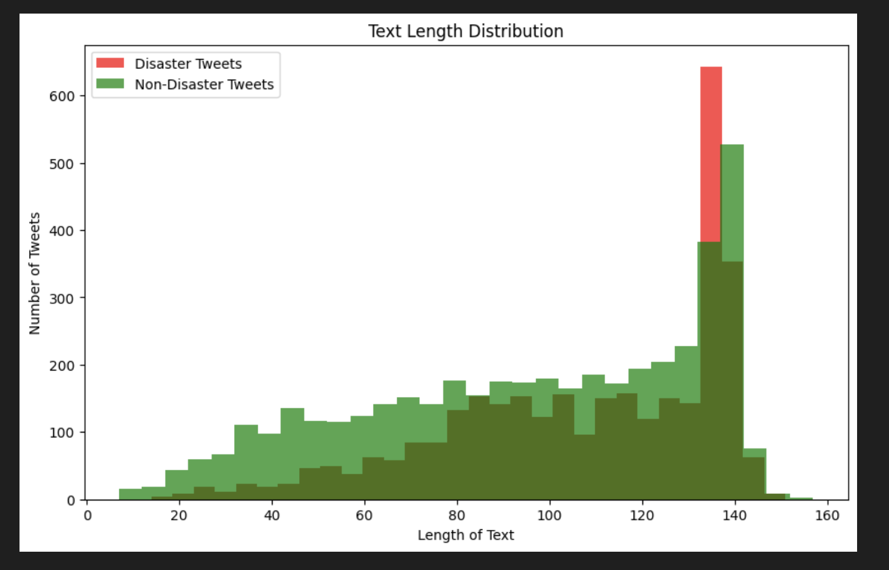
- 재난과 비재난 트윗의 텍스트 길이 분포를 비교하여 길이 차이가 있는지 확인합니다.

### 4. 재난/비재난 트윗의 단어 빈도 분석
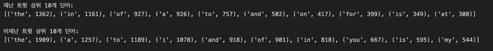
- 재난과 비재난 트윗에서 가장 자주 등장하는 단어를 분석합니다.

### 5. 불용어 제거 후 단어 빈도 및 워드클라우드 분석
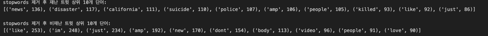
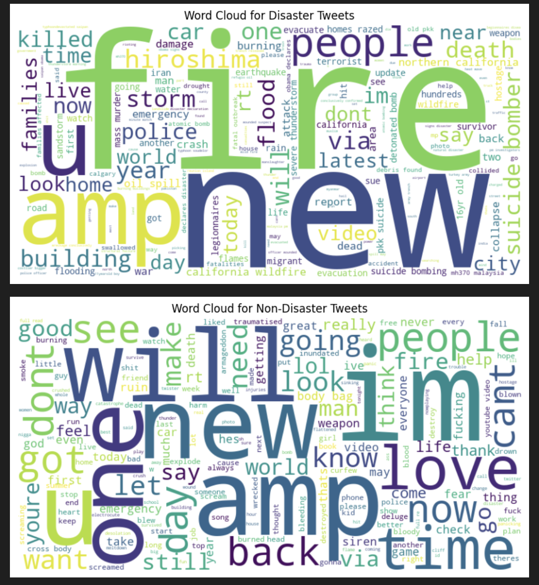
- 불용어를 제거한 후, 재난/비재난 트윗에서 유의미한 단어 빈도를 비교하고 워드클라우드를 통해 시각화합니다.

### 6. 해시태그 및 특수문자가 재난/비재난 트윗에 미치는 영향
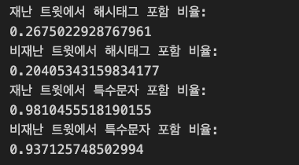
- 해시태그와 특수문자의 유무가 재난 트윗 분류에 미치는 영향을 분석합니다.

### 7. Location 열의 결측치 및 고유값 분석
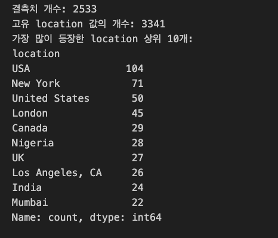
- Location 열의 결측치 분포를 확인하고, 고유값의 분포를 시각화합니다.
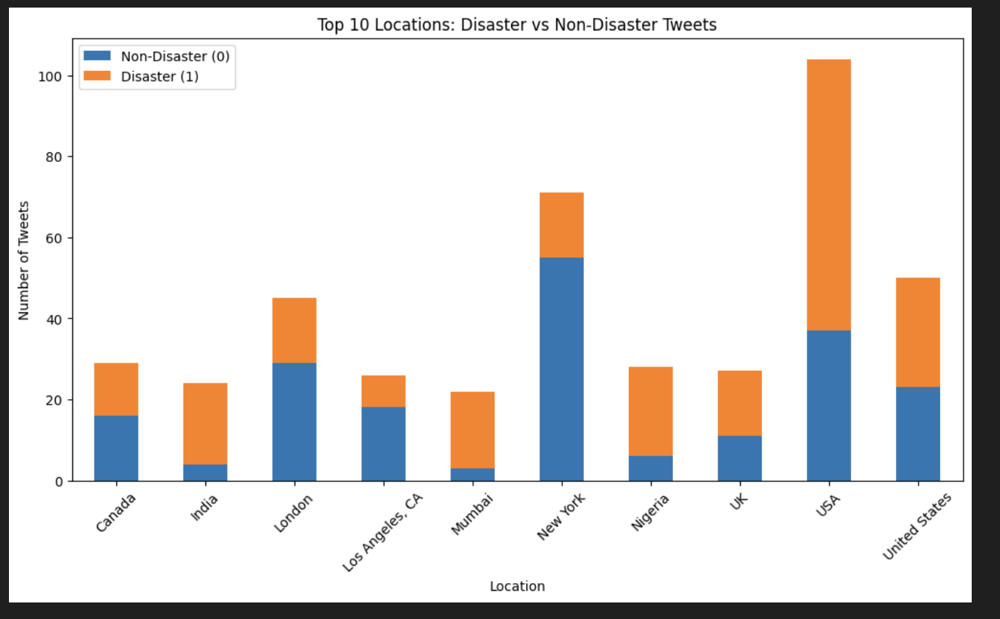
- Location 정보가 재난 트윗 분류에 유용한지 확인하기 위해 추가 시각화를 제공합니다.

### 8. 문장의 감정 분석이 재난 트윗 분류에 미치는 영향
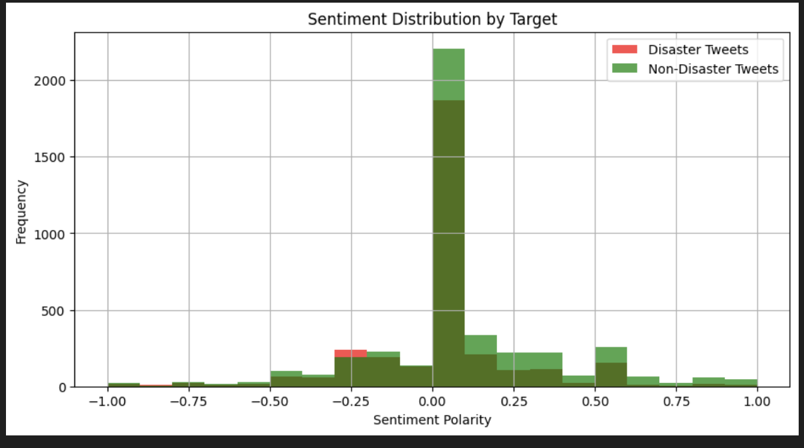
- 트윗의 감정(긍정, 부정, 중립)이 재난 트윗 분류에 영향을 미치는지 시각화하여 분석합니다.

---

## 🔧 모델 성능

### 1. 학습 손실 및 검증 정확도 변화 (Loss and Accuracy Per Epoch)
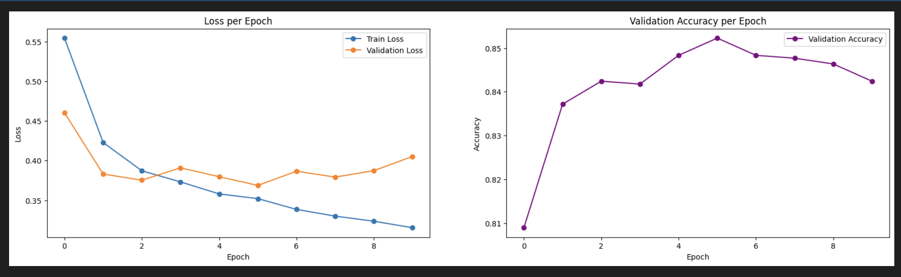
- 모델 학습 과정에서 손실(Loss)과 정확도(Accuracy)의 변화 추이를 시각화한 그래프입니다.
  - **왼쪽**: 에포크(epoch)에 따른 훈련 및 검증 손실의 감소 추이
  - **오른쪽**: 에포크(epoch)에 따른 검증 정확도의 증가 추이
- 손실 그래프는 초기 급격한 감소 이후 안정화되며, 검증 정확도는 일정 수준에서 정체되는 양상을 보입니다.

### 2. 정규화된 혼동 행렬 (Normalized Confusion Matrix)
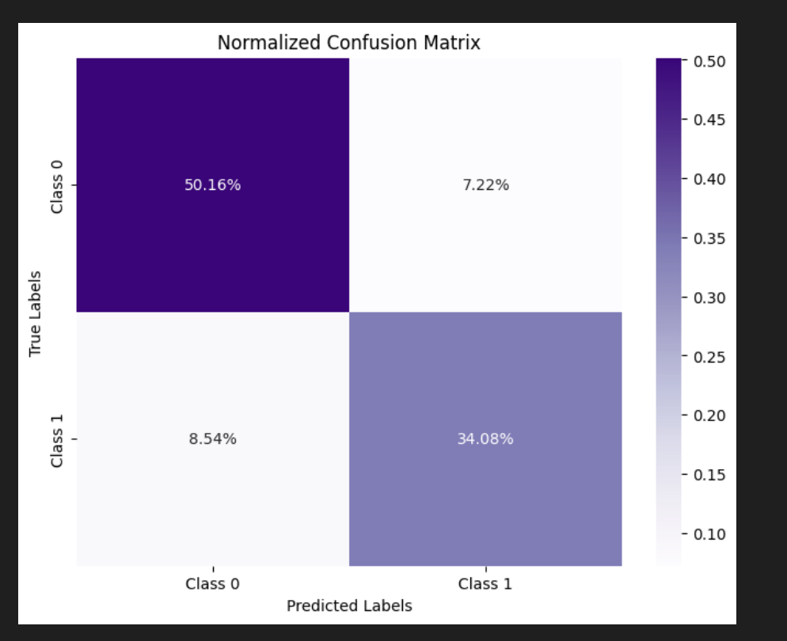
- 재난 트윗 분류 모델의 성능을 시각화한 혼동 행렬입니다.
- 각 셀은 정규화된 비율(%)로 표시되며, 모델의 예측 정확도를 직관적으로 확인할 수 있습니다.

| Metric                  | Value     | 설명                                     |
|-------------------------|-----------|------------------------------------------|
| **Validation Accuracy** | 0.8483    | 검증 데이터셋에서의 정확도               |
| **Validation F1 Score** | 0.8144    | 재난 트윗과 비재난 트윗 분류의 F1 점수    |
| **Precision**           | 0.8506    | 재난 트윗으로 정확히 분류된 비율          |
| **Recall**              | 0.7812    | 실제 재난 트윗을 올바르게 분류한 비율     |
| **Kaggle Public Score** | 0.84063   | Kaggle 제출 결과에서의 공개 점수         |
---

## 🔍 개선 여지
- 더 다양한 데이터셋을 사용하여 일반화 성능 향상
- 데이터 전처리 영역 강화
- k-fold cross validation으로 평가 신뢰도 증가

---